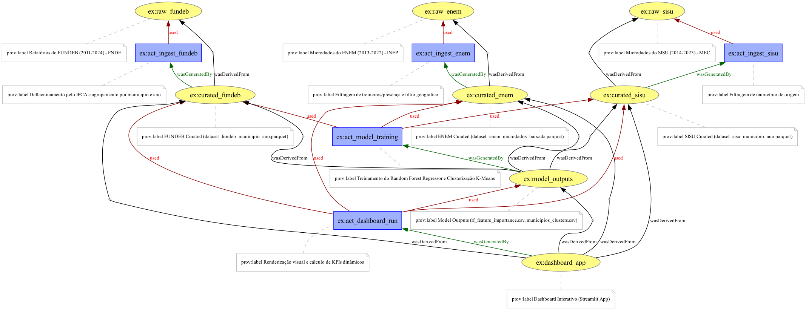

# Análise ENEM, SISU e FUNDEB na Baixada Fluminense

- [Autores e Orientação](#autores-e-orientação)
- [Resumo](#resumo)
- [Como Executar o Dashboard](#como-executar-o-dashboard)
- [Metodologia e Dados](#metodologia-e-dados)
- [Organização do Repositório](#organização-do-repositório)
- [Citação](#citação)
- [Licença](#licença)
- [Uso de IA Generativa](#uso-de-ia-generativa)

## Autores e Orientação

- **Autores:** Vitória Chaves, Alekssander Santos
- **Orientador:** Sergio Serra

## Resumo

Este repositório contém a infraestrutura de dados, análises exploratórias, modelagem de machine learning e o dashboard interativo do projeto que investiga a relação entre repasses do FUNDEB, proficiência no ENEM e acesso ao ensino superior (SISU) nos 13 municípios da Baixada Fluminense (2013-2023).

## Como Executar o Dashboard

O dashboard interativo foi construído em Python com Streamlit. Para executá-lo localmente, siga os passos abaixo:

1. Instale as dependências:
   ```bash
   pip install -r requirements.txt
   ```

2. Inicie a aplicação na raiz do projeto:
   ```bash
   streamlit run dashboard/app.py
   ```

3. Acesse o dashboard no seu navegador através da URL exibida no terminal (geralmente `http://localhost:8501`).

---

## Metodologia e Dados

O projeto processa e consolida bases de dados públicas através de uma pipeline de engenharia de dados de alta performance.

### Fontes de Dados

Os dados brutos (raw data) utilizados neste projeto estão disponíveis para consulta e reprodução [neste link do Google Drive](https://drive.google.com/drive/folders/1Dj4W_1Z34msuA_gFUKxVDLW4hEAzrTMz?usp=sharing).

| Fonte | Período | Detalhes |
|:---|:---|:---|
| **Microdados ENEM** | 2013–2022 | Notas e dados socioeconômicos (~190k registros na Baixada). |
| **Microdados SISU** | 2014–2023 | Inscrições e aprovações (alinhado com as edições do ENEM do ano anterior). |
| **Repasses FUNDEB** | 2011–2025 | Repasses mensais obrigatórios e convênios voluntários por município. |

> [!NOTE]
> O processamento lidou com desafios massivos: arquivos pesados do ENEM (3GB/ano), 3 formatos diferentes de planilhas no FUNDEB e variações no dicionário de variáveis do INEP ao longo da década.

### Grafo de Proveniência

Abaixo está o grafo de proveniência de todo o projeto gerado com W3C PROV, descrevendo a linhagem desde os dados originais até a modelagem e o dashboard:



### Detalhamento dos Scripts Principais (`scripts/`)

#### 1. Ingestão e Limpeza de Dados (ETL)
Estes scripts transformam os dados brutos massivos nos arquivos Parquet consolidados que alimentam o dashboard e os modelos:

- **`limpeza_enem.ipynb`** / **`reprocessar_enem.py`**: Lê os microdados do ENEM (2013-2022). Realiza filtros demográficos (ex: remove treineiros, ausentes), recalcula a nota média objetiva e mapeia o complexo dicionário de variáveis socioeconômicas do INEP para categorias legíveis.
- **`limpeza_sisu.ipynb`** / **`limpeza_sisu_cotas.py`**: Processa as 22 edições do SISU. Uniformiza as mudanças de nome de colunas que ocorreram ao longo da década, extrai a relação candidato/vaga e agrupa aprovações por grande área do conhecimento (Exatas, Humanas, Saúde) e por modalidade de concorrência.
- **`limpeza_fundeb.ipynb`**: Lida com os três formatos distintos de planilhas do Tesouro ao longo do tempo. Isola repasses vinculados ao FUNDEB e repasses voluntários, deflacionando valores financeiros.

#### 2. Análise e Modelagem de Machine Learning
Estes scripts consomem os dados limpos (pasta `curated/`) e geram os insights estatísticos (salvos em `output/`):

- **`analise_descritiva.ipynb`**: Focado em testes de hipóteses estatísticas. Executa a Análise de Variância (ANOVA) para comparar o desempenho entre municípios e gera as matrizes de correlação (Pearson/Spearman) entre os investimentos e notas.
- **`modelagem_ml.ipynb`**: Caderno principal de experimentação dos algoritmos preditivos, onde a regressão Linear Ridge e as otimizações do Random Forest foram validadas passo a passo.
- **`clusterizacao_micro.py`**: Responsável por aplicar o K-Means Clustering na base consolidada. Gera os agrupamentos não-supervisionados que identificam as similaridades dos municípios (agrupando por faixa de investimento, notas e aprovação no SISU).
- **`export_models_csv.py`**: Utilitário que extrai os coeficientes de Feature Importance do Random Forest e os rótulos do K-Means, salvando-os em CSV para que o Dashboard interativo possa consumi-los dinamicamente sem precisar re-treinar o modelo a cada acesso.
- **`gerar_prov_dot.py`**: Arquivo responsável por descrever e plotar o grafo visual (W3C PROV) com toda a linhagem dos dados do projeto, conectando scripts e datasets.

## Organização do Repositório

- `dashboard/`: Páginas e componentes da interface gráfica em Streamlit.
- `scripts/`: Notebooks Python e rotinas de pipeline, limpeza e treinamento de modelos.
- `raw_data/`: (Não versionado) Arquivos brutos originais extraídos dos órgãos federais.
- `curated/`: (Não versionado) Arquivos pré-processados salvos em `.parquet`.
- `output/`: Outputs gerados pelos modelos (gráficos, tabelas comparativas).
- `provenance/`: Grafo e metadados de proveniência dos dados (W3C PROV).

## Citação

Se este repositório for útil para sua pesquisa ou trabalho, por favor cite-o da seguinte forma:

```bibtex
@misc{chaves2026enemsisufundeb,
  author       = {Chaves, Vitória and Santos, Alekssander},
  title        = {Análise ENEM, SISU e FUNDEB na Baixada Fluminense},
  year         = {2026},
  howpublished = {\url{https://github.com/mendesv1t/analise-investimento-enem-sisu-baixada-fluminense}},
  note         = {Orientador: Sergio Serra}
}
```

## Licença

Este projeto está licenciado sob os termos da [Licença MIT](LICENSE).

## Uso de IA Generativa

Ferramentas de Inteligência Artificial Generativa (Claude/Claude Code, Anthropic) foram utilizadas como apoio na escrita, revisão e depuração de trechos de código dos scripts de ETL, modelagem e do dashboard (pastas [`scripts/`](scripts/) e [`dashboard/`](dashboard/)). A definição da metodologia, a escolha das fontes de dados, a interpretação dos resultados e as conclusões do trabalho são de responsabilidade dos autores.
